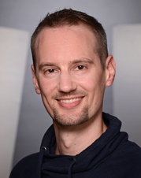

# Erik Fäßler

  

Overview | 
[[Research]](research.html) | 
[[Publications]](publication.html)

During my studies of computer science between 2002 and 2009 with the major subject of artifical intelligence I chose the minor subject of linguistics. This background led me to computational linguistics where I began my work as a research assistent in 2009. Since my time at the JULIE Lab as a PhD candidate I have been working on information extraction and information retrieval in the biomedical domain. In this line of research I worked on the semantic search engine [SeMedico](http://semedico.org/) which led me deeper into the fields of gene name recognition and normalization and into participating in the TREC Precision Medicine challenge in 2018 and 2019. Additionally, I am working with molecular and cell biologists by providing automatically extracting knowledge about gene interactions from the literature.

[[Google Scholar](https://scholar.google.de/citations?user=MKD5M4oAAAAJ&hl=de)] |
[[Researchgate](https://www.researchgate.net/profile/Erik_Faessler)]
 

## Contact details
Erik Fäßler 
Research Assistent

### Postal address
Fürstengraben 27 
07743 Jena 
Germany

### E-mail
[erik.faessler@uni-jena.de](mailto:Erik.Faessler@uni-jena.de)

### Telephone
+49 3641 9-44324

### Fax
+49 3641 9-44321
