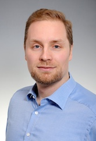

# Dr. des. Johannes Hellrich

  

My research is focussed on lexical semantics in diachronic and multilingual settings. I am currently involved in the [STAKI2B2](http://gepris.dfg.de/gepris/projekt/315098900) and [SMITH](http://www.smith.care/) projects on processing clinical language. I previously finished my doctoral thesis on language change in the graduate school [\"The Romantic Model\"](http://www.modellromantik.uni-jena.de/?lang=en) and worked in the [MANTRA](https://sites.google.com/site/mantraeu/) project on biomedical terminologies.

## Selected Publications
* **Johannes Hellrich**, Bernd Kampe & Udo Hahn (2019): [The Influence of Down-Sampling Strategies on SVD Word Embedding Stability](https://arxiv.org/abs/1808.06810). In: *[RepEval @ NAACL 2019](https://repeval2019.github.io)*. [to appear]
* **Johannes Hellrich**, Sven Buechel & Udo Hahn (2018): [JeSemE: A Website for Exploring Diachronic Changes in Word Meaning and Emotion](http://aclweb.org/anthology/C18-2003). In: *[COLING 2018](https://coling2018.org), System Demonstrations*. pp. 10-14.
* **Johannes Hellrich** & Udo Hahn: [Exploring Diachronic Lexical Semantics with JeSemE](http://aclweb.org/anthology/P/P17/P17-4006.pdf). In: *[ACL 2017](http://acl2017.org/), System Demonstrations*. pp. 31-36.
* **Johannes Hellrich** & Udo Hahn (2016): [Bad Company - Neighborhoods in Neural Embedding Spaces Considered Harmful](http://aclweb.org/anthology/C16-1262). In: *[COLING 2016](http://coling2016.anlp.jp/), Technical Papers*. pp. 2785-2796.
* **Johannes Hellrich**, Stefan Schulz, Sven Buechel & Udo Hahn (2015): [JUFIT: A Configurable Rule Engine for Filtering and Generating New Multilingual UMLS Terms](http://www.ncbi.nlm.nih.gov/pmc/articles/PMC4765630/). In: *AMIA Annual Symposium Proceedings 2015*, pp. 604-610.

[Full Publication List](publication.html)

[Google Scholar](https://scholar.google.de/citations?user=y89Vn00AAAAJ)

## Teaching Experience
* Introduction to Digital Humanities
* Introduction to Computational Linguistics
* Tutoring Undergraduate Linguistics

## Contact
Dr. des. Johannes Hellrich 
Research Assistant

| Email | [johannes.hellrich@uni-jena.de](mailto:johannes.hellrich@uni-jena.de) |
| Phone | +49 3641 9-44305 |
| Postal Address | Fürstengraben 27  07743 Jena  Germany |
| Room | E 008 |
