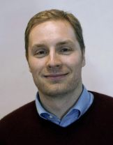

# Johannes Hellrich

  

My research is focussed on lexical semantics in diachronic and multilingual settings. I am currently involved in the [SMITH](http://www.smith.care/) project on processing clinical language. I previously finished my doctoral thesis as a member of the graduate school [\"The Romantic Model\"](http://www.modellromantik.uni-jena.de/?lang=en) and worked in the [MANTRA](https://sites.google.com/site/mantraeu/) project on biomedical terminologies.

## Selected Publications
* **Johannes Hellrich** & Udo Hahn: [Exploring Diachronic Lexical Semantics with JeSemE](http://aclweb.org/anthology/P/P17/P17-4006.pdf). In: [*ACL 2017*](http://acl2017.org/), System Demonstrations. Vancouver, Canada, July 30 - August 4, 2017, pp. 31-36. [[Link to system](http://jeseme.org/)]
* **Johannes Hellrich** & Udo Hahn: [Bad Company - Neighborhoods in Neural Embedding Spaces Considered Harmful](http://aclweb.org/anthology/C16-1262). In: [*COLING 2016*](http://coling2016.anlp.jp/). Osaka, Japan, December 13-16, 2016, pp. 2785-2796. [[Poster](/downloads/publications/posters/hellrich_coling2016.pdf)].
* **Johannes Hellrich** & Udo Hahn: [Measuring the Dynamics of Lexico-Semantic Change Since the German Romantic Period](http://dh2016.adho.org/abstracts/144). In: *Digital Humanities 2016: Conference Abstracts*. Krakow, Poland, July 11-16, 2016, pp. 545-547.
* **Johannes Hellrich**, Simon Clematide, Udo Hahn & Dietrich Rebholz-Schuhmann: [Collaboratively Annotating Multilingual Parallel Corpora in the Biomedical Domain-some MANTRAs](http://www.lrec-conf.org/proceedings/lrec2014/pdf/1064_Paper.pdf). In: *Proceedings of the Ninth International Conference on Language Resources and Evaluation (LREC\'14)*. 26-31 May, Reykjavik, Iceland, 2014. pp. 4033-4040.

[Full Publication List](publication.html)

[Google Scholar](https://scholar.google.de/citations?user=y89Vn00AAAAJ)

## Teaching Experience
* Introduction to Digital Humanities
* Introduction to Computational Linguistics
* Tutoring Undergraduate Linguistics

## Contact
Johannes Hellrich 
Research Assistant

| Email | [johannes.hellrich@uni-jena.de](mailto:johannes.hellrich@uni-jena.de) |
| Phone | +49 3641 9-44305 |
| Postal Address | Fürstengraben 27  07743 Jena  Germany |
| Room | E 008 |
