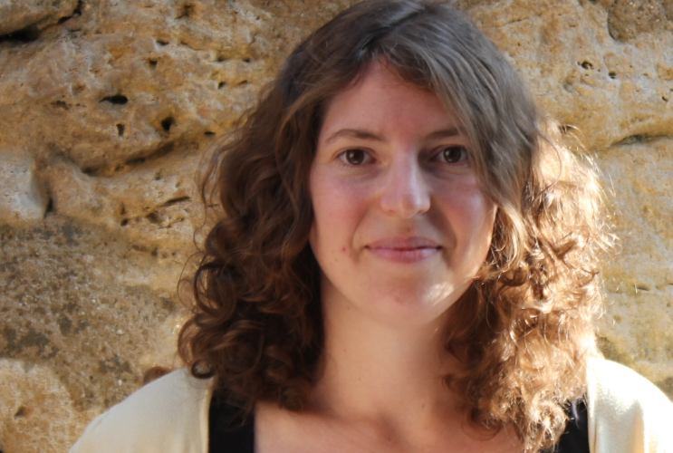

# Christina Lohr

  

## Curriculum Vitae
* since 2016: Research Assistant at the JULIE Lab of Friedrich Schiller University Jena
* 2015 - 2016: Research Assistant at the [Chemnitz University of Technology] (https://www.tu-chemnitz.de/), [Chair Media Informatics](https://www.tu-chemnitz.de/informatik/HomePages/Medieninformatik/) and [Chair Practical Computer Science](https://www.tu-chemnitz.de/informatik/PI/)
* 2007 - 2015: Student Assistant at [Klinikum Chemnitz (Klinik für Allgemein- und Viszeralchirurgie)](https://www.klinikumchemnitz.de/kliniken-bereiche/kliniken/allgemein-und-viszeralchirurgie/)
* 2012 - 2015: Studies of Computer Science at the Chemnitz University of Technology (Master of Science)
* 2007 - 2012: Studies of Applied Computer Science at the Chemnitz University of Technology (Bachelor of Science)

## Research Interests

* Natural Language Processing with clinical contents

## Projects Involved
* [STAKI2B2](http://gepris.dfg.de/gepris/projekt/315098900)
* [SMITH](http://www.smith.care/)

## Teaching Experience
* Basics of Theoretical computer science
* Basics of Parallel programming

## Publications

### 2019

* Tobias Kolditz, **Christina Lohr**, Johannes Hellrich, Luise Modersohn, Boris Betz, Michael Kiehntopf, Udo Hahn: Annotating German Clinical Documents for De-Identification (accepted at MedInfo 2019 Lyon)

### 2018

* **Christina Lohr**, Stephanie Luther, Franz Matthies, Luise Modersohn, Danny Ammon, Kutaiba Saleh, Andreas G. Henkel, Michael Kiehntopf, and Udo Hahn:
[CDA-Compliant Section Annotation of German-Language Discharge Summaries: Guideline Development, Annotation Campaign, Section Classification.]
(https://www.ncbi.nlm.nih.gov/pubmed/30815119) In: AMIA Annual Symposium Proceedings 2018, San Francisco, USA, Nov 3-7. [[Slides](/downloads/publications/slides/lohr-2018-amia-sections-slides.pdf)] [[PMCID: PMC6371337](https://www.ncbi.nlm.nih.gov/pubmed/30815119)] [[PMID: 30815119](https://www.ncbi.nlm.nih.gov/pubmed/30815119)]

* **Christina Lohr**, Sven Buechel, and Udo Hahn. 2018. [Sharing Copies of Synthetic Clinical Corpora without Physical Distribution - A Case Study to Get Around IPRs and Privacy Constraints Featuring the German JSYNCC Corpus](http://www.lrec-conf.org/proceedings/lrec2018/pdf/701.pdf). In: LREC 2018 - Proceedings of the 11th International Conference on Language Resources and Evaluation. Miyazaki, Japan, May 7 - 12, 2018. Pages 1259 -1266. [[Code](https://github.com/julielab/jsyncc)] [[Poster](/downloads/publications/posters/Poster_LREC_JSYNCC.pdf)]

* Udo Hahn, Franz Matthies, **Christina Lohr**, Markus Löffler. [3000PA-Towards a National Reference Corpus of German Clinical Language](http://ebooks.iospress.nl/volumearticle/48747). In: Studies in Health Technology and Informatics,
Vol. 247: Building Continents of Knowledge in Oceans of Data: The Future of Co-Created eHealth - Proceedings of MIE 2018, Gothenburg, Sweden, April 24-26 2018. [[Slides](/downloads/publications/slides/lohr2018-mie-3000PA-slides.pdf)]

### 2016

* **Christina Lohr** and Robert Herms: [A Corpus of German Clinical Reports for ICD and OPS-based Language Modeling](http://www.lrec-conf.org/proceedings/lrec2016/workshops/LREC2016Workshop-CLAW_Proceedings.pdf). In: Key-Sun Choi and Sejin Nam (Eds.): Proceedings of the Controlled Language Applications Workshop (CLAW) at LREC 2016, Portorož, Slovenia, 28.05.2016, pp. 20-23.

* Mike Ebersbach, Robert Herms, **Christina Lohr**, and Maximilian Eib: [Wrappers for Feature Subset Selection in CRF-based Clinical Information Extraction](http://ceur-ws.org/Vol-1609/16090069.pdf). In: Conference and Labs of the Evaluation Forum (CLEF), CLEF eHealth Lab, Évora, Portugal, 05.-08.09.2016.

### 2014

* **Christina Lohr** and Robert Herms: [Vertrauen in Spracherkennung...?](http://www.qucosa.de/fileadmin/data/qucosa/documents/13349/linux_2014.pdf). In: Chemnitzer Linux-Tage 2014 Tagungsband, Chemnitz, Gemany, 15./16.03.2014, pp. 107-115.

### 2012

* **Christina Lohr**: [Sprachmodelladaption von CMU Sphinx für den Einsatz in der Medizin](http://www.qucosa.de/fileadmin/data/qucosa/documents/9004/tagungsband_tucsis12.pdf). In: Studentensymposium Informatik Chemnitz 2012, Tagungsband zum 1. Studentensymposium Chemnitz vom 4. Juli 2012, 04.07.2012, Germany, pp. 38-51.

## Contact

| Email | [christina.lohr@uni-jena.de](mailto:christina.lohr@uni-jena.de) |
| Phone	| +49 3641 9-44303 |
| Postal Address | Fürstengraben 30  07743 Jena  Germany |
| Room	| Fürstengraben 27 E 007 |
